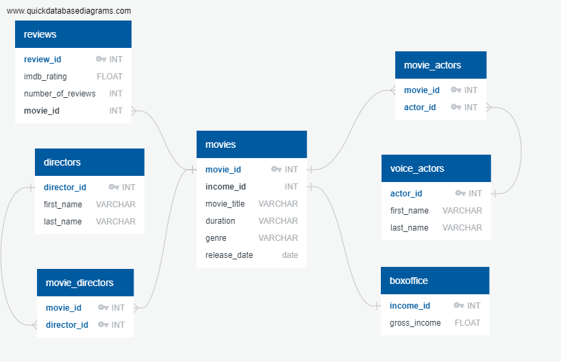

# ETL_Project
The project was completed by Qi, Maryam, and Karly.

For this ETL Project, we built a database containing information about Disney movies. We gathered data from Kaggle.com as well as scraped data from IMDB.com. This data was combined into one file and saved to a relational database in PostgresSQL with seven tables. 

# What can we do with this data?
This data can be used for a variety of projects ranging from visualizations to statistical analysis to comparisons and more.
Some examples could include creating visualizations and performing analyses to determine what Disney movie genres are most popular or profitable. Others could pertain to determining which director has directed the greatest number of Disney movies or which actor has participated in the largest amount of Disney movies.

# These are the steps that were taken:

1.	The database schema was created utilizing quickdatabasediagrams.com. 
The ERD Schema Script can be found in sql file (see [ERD_Schema_Script.txt](sql/ERD_Schema_Script.txt)) :

!

2.	The SQL_Schema was used to establish our database in PostgresSQL (see [SQL_Schema.sql](sql/SQL_Schema.sql))

3.	Once the database is ready, the ETL process can begin.

# Extract
-	To begin, the Kaggle data source is loaded, and the IMDB source is scraped to retrieve movie duration, movie rating, number of reviews, directors and voice actors. 
o	disney_movies.csv - ( https://www.kaggle.com/prateekmaj21/disney-movies )
o	IMDB.com ( https://www.imdb.com/list/ls068561553/ )

# TRANSFORM
1.	Box Office:
• Create unique box_df from disney_df with income_id and gross_income

2.	Movie:
• Merge disney_df and rating_df on the movie's title
• Fill null values with placeholders 
• Create unique new_movie_df from movie_df with movie_id, Title, release_date, genre, Duration, income_id
• Drop duplicate values
• Change column labels 
• Create unique genre_sum dataframe with genre and total_gross sorted in descending order for further lookups

3.	Review:
• Merge disney_df and rating_df on the movie's title
• Create unique new_rating_df from movie_df with rating_id, Title, IMDB_rating and Number_of_Reviews
• Drop null values
• Drop duplicate values
• Change necessary datatypes
• Create unique highest_score_movie dataframe with Title and IMDB_rating sorted in descending order for further lookups
• Create unique highest_reviews_movie dataframe with Title and IMDB_rating sorted in descending order for further lookups

4.	Director:
• Create unique new_director_df from disney_director_df with director_id, title, director 
• Split director's full name into first and last
• Change column labels
• Group movie title by number of directors in descending order
• Group directors by number of titles in descending order

5. Movie directors
• Create unique dataframe movie_director_df to connect Directors table with Movie table

6.	Actors:
• Create unique new_actor_df from disney_actor_df with actor_id and cast
• Split actor's full name into first and last
• Change column labels
• Group title by number of actors in descending order
• Group actors by number of titles in descending order

7. Movie actors
• Create unique dataframe movie_actor_df to connect Actors table with Movie table

# Load
• Now, we can load the data into PostgresSQL database (Make sure all tables are created)
• A test sql file combining all 7 tables shows it worked correctly.
************
